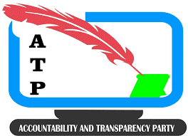

<a name="readme-top"></a>

<!-- LOGO -->

<div align="center">
  
  <br/>
  <h3><b>ATP README Template</b></h3>
</div>

<!-- TABLE OF CONTENTS -->

# 📗 Table of Contents

- [📗 Table of Contents](#-table-of-contents)
- [📖 Accountability \& Transparency Party (ATP) App ](#-accountability--transparency-party-atp-app-)
  - [🛠 Built With ](#-built-with-)
    - [Tech Stack ](#tech-stack-)
    - [Key Features ](#key-features-)
  - [🚀 Live Demo ](#-live-demo-)
  - [💻 Getting Started ](#-getting-started-)
    - [Prerequisites](#prerequisites)
    - [Setup](#setup)
    - [Install](#install)
    - [Usage](#usage)
    - [Deployment](#deployment)
  - [👥 Authors ](#-authors-)
  - [🔭 Future Features ](#-future-features-)
  - [🤝 Contributing ](#-contributing-)
  - [⭐️ Show your support ](#️-show-your-support-)
  - [🙏 Acknowledgments ](#-acknowledgments-)
  - [📝 License ](#-license-)

<!-- PROJECT DESCRIPTION -->

# 📖 Accountability & Transparency Party (ATP) App <a name="about-project"></a>

The Accountability & Transparency Party (ATP) App is a digital platform designed to promote transparency, accountability and enhance public participation for good governance by leveraging technology for real-time updates, community engagement, insights into political activities and decisions.

## 🛠 Built With <a name="built-with"></a>

### Tech Stack <a name="tech-stack"></a>

<details>
  <summary>Client</summary>
  <ul>
    <li><a href="https://nextjs.org/docs">Next.js</a></li>
  </ul>
</details>

<details>
  <summary>Server</summary>
  <ul>
    <li><a href="https://nodejs.org">Node.js</a></li>
  </ul>
</details>

<details>
<summary>Database</summary>
  <ul>
    <li><a href="https://supabase.com">Supabase PostgreSQL</a></li>
  </ul>
</details>

<!-- Features -->

### Key Features <a name="key-features"></a>

- **Real-Time Voting System:** <br> The app includes a robust digital real-time voting system where users can cast votes on various political issues and choose preferred candidates ensuring transparency and community engagement .
- **Transparency:**<br> The app provides real-time updates/notifications and insights into party political activities and decisions, ensuring transparency.
- **Accountability:**<br> The app provides an online platform where party elected leaders and officials are frequently engaged directly by the public through recorded zoom meetings, ensuring accountability.

<p align="right">(<a href="#readme-top">back to top</a>)</p>

<!-- LIVE DEMO -->

## 🚀 Live Demo <a name="live-demo"></a>

- [Live Demo Link](https://atp-party.vercel.app)

<p align="right">(<a href="#readme-top">back to top</a>)</p>

<!-- GETTING STARTED -->

## 💻 Getting Started <a name="getting-started"></a>

To get a local copy up and running, follow these steps.

### Prerequisites

In order to run this project you need:

- [Node.js](https://nodejs.org)
- [Git](https://git-scm.com)
- [Supabase](https://supabase.com) as a database hosting service and for real-time capabilities
- [Prisma](https://www.prisma.io) as an ORM
- [NextAuth.js](https://next-auth.js.org) for authentication & authorization
- [VSCode](https://code.visualstudio.com) or any other code editor of your choice

### Setup

Clone this repository to your desired folder:

`git clone https://github.com/BenMKT/atp-party.git`

or

`git clone git@github.com:BenMKT/atp-party.git` <-- _Only if you have [SSH keys configured](https://docs.github.com/en/authentication/connecting-to-github-with-ssh/adding-a-new-ssh-key-to-your-github-account) on your GitHub account_.

Create and fill in the below required environment variables in the `.env` file:

```bash
# use these variables connecting using prisma gotten from the supabase connection strings and environment variables for your app
DATABASE_URL="replace with your Supabase database URL"
DIRECT_URL="replace with your Supabase direct URL"

# create a random string used to hash tokens, sign/encrypt cookies and generate cryptographic keys using openssl command
AUTH_SECRET="replace with your openssl generated secret key"
```

### Install

Install this project with:

```bash
  cd PATH_TO_CLONE
  npm install
```

### Usage

First, run the development server:

```bash
npm run dev
# or
yarn dev
# or
pnpm dev
# or
bun dev
```

Open [http://localhost:3000](http://localhost:3000) with your browser to see the result.

This project uses [`next/font`](https://nextjs.org/docs/basic-features/font-optimization) to automatically optimize and load Inter, a custom Google Font.

<!--
### Run tests

To run tests, run the following command:


Example command:

```sh
  bin/rails test test/models/article_test.rb
```
--->

### Deployment

You can deploy this project using:

- [Vercel](https://vercel.com) or any other cloud platform of your choice

Check out [Next.js deployment documentation](https://nextjs.org/docs/deployment) for more details.

<p align="right">(<a href="#readme-top">back to top</a>)</p>

<!-- AUTHORS -->

## 👥 Authors <a name="authors"></a>

👤 **Benson Kiai**

- GitHub: [@myGitHub](https://github.com/BenMKT)
- LinkedIn: [myLinkedIn](https://www.linkedin.com/in/bensonkiai)

<p align="right">(<a href="#readme-top">back to top</a>)</p>

<!-- FUTURE FEATURES -->

## 🔭 Future Features <a name="future-features"></a>

- [ ] **Add News Feeds route & functionality**
- [ ] **Add Accountability route & functionality**
- [ ] **Payment and ORPP API's integration**
- [ ] **Add real-time App notifications for voting, events, activities and meetings**
- [ ] **Conform to Web Accessibility Standards**
- [ ] **Add Tests**
- [ ] **Transform to be both a Web and Mobile App**

<p align="right">(<a href="#readme-top">back to top</a>)</p>

<!-- CONTRIBUTING -->

## 🤝 Contributing <a name="contributing"></a>

Contributions are welcomed to improve the functionality, UI and UX of the Application. If you have ideas, suggestions, or bug reports, please feel free to open an issue or submit a pull request. Let's collaborate and share ideas!

To contribute to this project, kindly follow these steps:

1. Fork the repository.
2. Create a new branch for your feature or bug fix.
3. Implement your changes and commit them with clear, descriptive messages.
4. Push the changes to your fork.
5. Submit a pull request to the main repository with a detailed explanation of your changes.

Please ensure you follow industry coding standards, best practices, and guidelines provided in the project documentation.

Feel free to check the [issues page](https://github.com/BenMKT/atp-party/issues).

<p align="right">(<a href="#readme-top">back to top</a>)</p>

<!-- SUPPORT -->

## ⭐️ Show your support <a name="support"></a>

If you like this project, please give it a star! ⭐️

<p align="right">(<a href="#readme-top">back to top</a>)</p>

<!-- ACKNOWLEDGEMENTS -->

## 🙏 Acknowledgments <a name="acknowledgements"></a>

I would like to express my sincere gratitude to the Microverse team for providing the guidance and support needed to acquire Full-Stack Software Developer skills necessary to build this project.

<p align="right">(<a href="#readme-top">back to top</a>)</p>

<!-- FAQ (optional)

## ❓ FAQ (OPTIONAL) <a name="faq"></a>

> Add at least 2 questions new developers would ask when they decide to use your project.

- **[Question_1]**

  - [Answer_1]

- **[Question_2]**

  - [Answer_2]

<p align="right">(<a href="#readme-top">back to top</a>)</p>
-->

<!-- LICENSE -->

## 📝 License <a name="license"></a>

This project is [MIT](./LICENSE) licensed.

_NOTE: I recommend using the [MIT license](https://choosealicense.com/licenses/mit/) - you can set it up quickly by [using templates available on GitHub](https://docs.github.com/en/communities/setting-up-your-project-for-healthy-contributions/adding-a-license-to-a-repository). You can also use [any other license](https://choosealicense.com/licenses/) if you wish._

<p align="right">(<a href="#readme-top">back to top</a>)</p>
